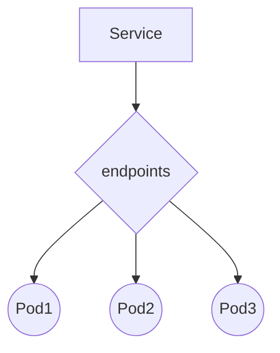

# Service：服务发现

## Service入门介绍

需要Service的原因，我觉得主要从两个方面考虑：

1. Pod的状态并不稳定，导致PodIP会随时变化；
2. 水平伸缩会使多个Pod提供相同的服务来负载均衡，但每个Pod的ip肯定说不一样的；

所以就需要一个稳定的地址来暴露服务给用户，用户完全不需要考虑podip是多少，这个就是服务发现 service。

1. Service的实现需要依赖于coredns，coredns是默认需要部署在集群内的一个服务；
2. 每个node上的kube-proxy始终会去监视集群内有关service的变动，通过`watch`请求方式，然后与master节点的api-server交互，获取任何一个与service有关的变动情况；然后kube-proxy都要把它转换为当前node之上能够调度到后端pod的规则（iptables/ipvs，取决于kube-proxy中设置的规则）。
3. 3种不同的IP：
   1. NodeIP：节点的真实IP
   2. ClusterIP：也叫做ServiceIP
   3. PodIP：就是Pod的集群内部地址
4. 3种不同的Port：
   1. NodePort：节点端口
   2. port：service的port
   3. targetPort：也就是containerPort
5. 如果一个Pod中有多个容器，他们共用同一个PodIP，他们直接访问是通过不同的端口来实现的。而service中指定的port是和targetPort也就是containerPort映射的。可以发现其实并没有pod port这个概念。

## kubectl expose

通过kubectl expose 创建service，通过 kubectl expose -h 查询详细具体内容;

```yaml
kubectl expose可以使用的对象：
pod (po), service (svc), replicationcontroller (rc), deployment (deploy), replicaset (rs)
```

需要注意：

1. expose pod：前提要求pod必须有label，否则出错如下：

   ```yaml
   $ kubectl expose po httpd-manual --port=8080 --target-port=80
   error: couldn't retrieve selectors via --selector flag or introspection: the pod has no labels and cannot be exposed
   ```

2. expose controller：前提是`.spec.selector`必须设置。

几个expose实例：

Expose svc: `kubectl expose service -n nginx nginx --name=nginx1 --port=80 --type=NodePort`

Expose pod: `kubectl expose po httpd-manual --port=8080 --target-port=80`

Expose controller: `kubectl expose replicationcontroller -n controller-test kubia --name rc-expose --port=8080 --target-port=8080`

Expose from yaml: `kubectl expose -f ReplicationContraller.yaml -n controller-test --name=rc-expose2 --port=8080 --target-port=8080`

> ​	这个是根据yaml文件中的`.spec.selector`来创建service


## Service中的配置选项

关于Service的详细介绍：

```bash
kubectl explain svc.spec
```

一个简单的Service yaml文件

```yaml
apiVersion: v1
kind: Service
metadata:
  name: kubia
spec:
  ports:
  - port: 80
    targetPort: 8080
  selector:
    app: kubia
```

### 会话亲和度

通过配置service的`.spec.sessionAffinity: ClientIP`：实现从同一个clientIP的所有请求，均转发到同一个pod。

该参数只有两个可选项，默认为none。

### Service配置多端口

```yaml
kind: Service
apiVersion: v1
metadata:
  name: my-service
spec:
    selector:
      app: MyApp
    ports:
      - name: http
        protocol: TCP
        port: 80
        targetPort: 9376
      - name: https
        protocol: TCP
        port: 443
        targetPort: 9377
```

### 使用命名的端口	

**为什么要使用命名端口的方式：**最大的好处就是即使更换containerPort，也不需要改变service的targetPort。

比如现在你的pod中containerPort是8080，但你想更改他为80，使用命名的端口的话你只需要修改pod.spec.ports.containerPort为80，而不需要你去再修改service。

使用命名的端口，需要首先在pod中指定名字：

```yaml
kind: Pod
metedata:
  name: kubia
spec:
  containers:
    ports:
    - name: httpname1
      containerPort: 8080
    - name: httpsname2
      containerPort: 8443
```

由此可以明确的看到：tagetPort=containerPort 这样就不会混淆了。

```yaml
apiVersion: v1
kind: Service
metadata:
  name: kubia
spec:
  ports:
  - name: http
    port: 80
    targetPort: httpname1
  - name: https
    port: 443
    targetPort: httpsname2
  selector:
    app: kubia
```

## 集群内部域名

查询容器内部的环境变量。

```bash
kubectl exec -n nginx nginx-56b5c7ff74-vmt6t -- env
```

```bash
PATH=/usr/local/sbin:/usr/local/bin:/usr/sbin:/usr/bin:/sbin:/bin
HOSTNAME=nginx-56b5c7ff74-vmt6t
NGINX_VERSION=1.7.9-1~wheezy
KUBERNETES_SERVICE_HOST=10.43.0.1
KUBERNETES_SERVICE_PORT_HTTPS=443
NGINX_PORT_80_TCP_PORT=80
KUBERNETES_PORT_443_TCP_PROTO=tcp
KUBERNETES_PORT_443_TCP_PORT=443
KUBERNETES_PORT_443_TCP_ADDR=10.43.0.1
NGINX_PORT_80_TCP_PROTO=tcp
NGINX_PORT_80_TCP_ADDR=10.43.210.231
KUBERNETES_SERVICE_PORT=443
KUBERNETES_PORT_443_TCP=tcp://10.43.0.1:443	
NGINX_SERVICE_HOST=10.43.210.231						# servicIP
NGINX_SERVICE_PORT=80												# servicePort
KUBERNETES_PORT=tcp://10.43.0.1:443
NGINX_PORT=tcp://10.43.210.231:80
NGINX_PORT_80_TCP=tcp://10.43.210.231:80
HOME=/root
```

> 注意服务名称中的横杠被转换为下画线，并且当服务名称用作环境变量名称中的前缀时，所有的字母都是大写的。

每一个服务创建以后，都会在DNS中自动添加资源记录；kubernetes通过修改每个容器的/etc/resolve.conf文件实现；pod是否使用内部的DNS服务器是根据pod.spec.dnsPolicy属性来决定的。

客户端Pod在知道Service的名称后可以通过全限定域名（FQDN）来访问，而不是查询环境变量。

域名格式为：`SVC_NAME.NS_NAME.DOMAIN.LTD`，默认的域名后缀为：`svc.cluster.local`

```yaml
$ kubectl get svc -n nginx
NAME    TYPE       CLUSTER-IP      EXTERNAL-IP   PORT(S)        AGE
nginx   NodePort   10.43.210.231   <none>        80:30088/TCP   12d
$ nslookup nginx.nginx.svc.cluster.local 10.43.0.10				# coredns的地址
Server:		10.43.0.10
Address:	10.43.0.10:53

Name:	nginx.nginx.svc.cluster.local
Address: 10.43.210.231
```

## Headless Service

Headless Services是一种特殊的service，其spec.clusterIP表示为None，这样在实际运行时就不会被分配ClusterIP

```yaml
$ kubectl explain svc.spec.clusterIP
KIND:     Service
VERSION:  v1
FIELD:    clusterIP <string>
DESCRIPTION:
     clusterIP is the IP address of the service and is usually assigned randomly
     by the master. If an address is specified manually and is not in use by
     others, it will be allocated to the service; otherwise, creation of the
     service will fail. This field can not be changed through updates. Valid
     values are "None", empty string (""), or a valid IP address. "None" can be
     specified for headless services when proxying is not required. Only applies
     to types ClusterIP, NodePort, and LoadBalancer. Ignored if type is
     ExternalName. More info:
     https://kubernetes.io/docs/concepts/services-networking/service/#virtual-ips-and-service-proxies
```

创建一个headless的Service

```yaml
apiVersion: v1
kind: Service
metadata:
  name: nginx-headless
  namespace: nginx
spec:
  clusterIP: None
  ports:
  - port: 80
    targetPort: 80
  selector:
    app: nginx
```

现象，svc的CLUSTER-IP是none，也就是没有ServiceIP，我们用集群内域名解析他的全限定域名FQDN，解析到的是他的Pod的IP：

```
kubectl get svc -n nginx
NAME             TYPE        CLUSTER-IP     EXTERNAL-IP   PORT(S)        AGE
nginx-headless   ClusterIP   None           <none>        80/TCP         4m51s

# dig -t A nginx-headless.nginx.svc.cluster.local. @10.1.0.10
...
;; ANSWER SECTION:
nginx-headless.nginx.svc.cluster.local.	30 IN A	10.244.2.46
...

# kubectl get pods -n nginx -o wide
NAME                     READY   STATUS    RESTARTS   AGE   IP            NODE    NOMINATED NODE   READINESS GATES
nginx-8475b6dc48-p8hd9   1/1     Running   0          19d   10.244.2.46   node1   <none>           <none>
```

- 另外，通过headless service 可以轻松找到statefulSet的所有节点;
- `statefulSet.spec.serviceName`，当serviceName配置成与headless service的Name 相同的时候，可以通过 `{hostName}.{headless service}.{namespace}.svc.cluster.local` 解析出PodIP;
- hostName 由 {statefulSet name}-{编号} 组成。[参考来源](https://www.cnblogs.com/pythonPath/p/12750180.html)

```bash
# nslookup prometheus-cluster-monitoring-0.prometheus-operated.cattle-prometheus.svc.cluster.local 10.43.0.10
Server:    10.43.0.10
Address 1: 10.43.0.10 kube-dns.kube-system.svc.cluster.local

Name:      prometheus-cluster-monitoring-0.prometheus-operated.cattle-prometheus.svc.cluster.local
Address 1: 10.42.6.63 10-42-6-63.access-prometheus.cattle-prometheus.svc.cluster.local
```

Headless Service[使用场景](https://blog.csdn.net/zhangshaohuas/article/details/107552452)

1. client想自己决定使用哪个Real Server,可以通过查询DNS来获取真实的Server地址，也就是PodIP；
2. headless service关联的每个endpoint(也就是Pod)都会有对应的DNS域名，也就是上面说的域名，这样Pod之间就可以直接互相访问；

## 连接集群外部服务

### ExternalName

```yaml
kind: Service
apiVersion: v1
metadata:
  name: search
  namespace: default
spec:
  type: ExternalName
  externalName: www.baidu.com
```

```bash
$ kubectl get svc
NAME         TYPE           CLUSTER-IP   EXTERNAL-IP      PORT(S)   AGE
search       ExternalName   <none>       www.baidu.com    <none>    9s
```

解析一下域名：

```yaml
$ nslookup search.default.svc.cluster.local 10.43.0.10
Server:		10.43.0.10
Address:	10.43.0.10:53

search.default.svc.cluster.local	canonical name = www.baidu.com
www.baidu.com	canonical name = www.a.shifen.com
Name:	www.a.shifen.com
Address: 39.156.66.14
Name:	www.a.shifen.com
Address: 39.156.66.18

search.default.svc.cluster.local	canonical name = www.baidu.com
www.baidu.com	canonical name = www.a.shifen.com
Name:	www.a.shifen.com
Address: 2409:8c00:6c21:104c:0:ff:b02c:156c
Name:	www.a.shifen.com
Address: 2409:8c00:6c21:104f:0:ff:b03f:3ae
-----------------------------------------------------
$ nslookup www.baidu.com
Server:		172.24.1.1
Address:	172.24.1.1:53

Non-authoritative answer:
www.baidu.com	canonical name = www.a.shifen.com
Name:	www.a.shifen.com
Address: 39.156.66.18
Name:	www.a.shifen.com
Address: 39.156.66.14

Non-authoritative answer:
www.baidu.com	canonical name = www.a.shifen.com
Name:	www.a.shifen.com
Address: 2409:8c00:6c21:104f:0:ff:b03f:3ae
Name:	www.a.shifen.com
Address: 2409:8c00:6c21:104c:0:ff:b02c:156c
```

可以很明显看到，ExternalName仅在DNS级别实施的，换言之就是针对有域名的外部服务，只是为外部服务在集群内的DNS服务器上，也就是coredns创建了个简单的CNAME DNS记录。`search.default.svc.cluster.local	canonical name = www.baidu.com`

> CNAME记录指向全限定域名而不是IP地址

### Endpoints理解

Service和pod之间并不是直接关联的，他们中间存在一个介质endpoints;




```bash
# kubectl describe svc -n kubernetes-dashboard kubernetes-dashboard
Name:                     kubernetes-dashboard
Namespace:                kubernetes-dashboard
Labels:                   k8s-app=kubernetes-dashboard
Selector:                 k8s-app=kubernetes-dashboard
Type:                     NodePort
IP:                       10.1.192.5
Port:                     <unset>  443/TCP
TargetPort:               8443/TCP
NodePort:                 <unset>  30000/TCP
Endpoints:                10.244.0.10:8443,10.244.0.13:8443
Session Affinity:         None
External Traffic Policy:  Cluster
Events:                   <none>
```

> Selector：通过这个来确定哪些pod与这个endpoints连接
>
> Endpoints：Service endpoint对应的pod的IP和端口列表

endpoints里面是一个endpoint列表：

```yaml
# kubectl get endpoints -n kubernetes-dashboard kubernetes-dashboard
NAME                   ENDPOINTS                           AGE
kubernetes-dashboard   10.244.0.10:8443,10.244.0.13:8443   56d
```

> Endpoints对应的就是PodIP和端口

关于endpoints需要注意的地方：

1. endpoints在一般情况中是自动创建的，这里指的一般情况是svc中指定了selector，也可以不指定那就需要手动创建，下面会讲到。
2. endpoints与svc关联是通过相同的名字，所以需要保证svc和endpoints的名字一致。
3. svc中的端口，是你在集群中访问需要的端口，而真正的外部服务的IP和端口是在endpoints中指明的，这两个端口可以不同，相同只是便于分辨而已。

### 通过Endpoints连接集群外部服务

也可以称为外挂式部署。                

首先理解所谓服务（应用层），无非就是IP+端口。

所谓外挂式，就是把集群外的服务，挂载到集群里面，看上去和部署在集群里面的服务一样。

关键在于创建了一个endpoint

如果创建了不包含pod selector（在集群里见到selector就是Pod的selector，比如节点选择器就要指明NodeSelector）的service，kubernetes就不会创建endpoint（毕竟缺少选择器，将不会知道service中包含哪些pod）。这样就需要手动创建Endpoints资源来指定endpoint列表。

1. 首先创建一个没有selector的service

   ```yaml
   apiVersion: v1
   kind: Service
   metadata:
     name: external-service
   spec:
     ports:
     - port: 80
   ```

   > 这里的port只是集群内部访问的端口，跟真正外部服务的端口没有关系，简单来说就是在集群内部访问这个端口转发到endpoints上指定的外部服务的真正端口

2. 手动创建endpoints

   ```yaml
   apiVersion: v1
   kind: Endpoints
   metadata:
     name: external-service
   subsets:
     - addresses:
       - ip: 11.11.11.11
       - ip: 22.22.22.22
       ports:
       - port: 32322
   ```

   > 地址可以指定多个实现负载均衡；这里的port就是真正服务的端口。


## NodePort

NodePort将集群内部的服务映射为NodeIP+NodePort，外部客户端访问服务只需要

一个典型nodeport.yaml例子：


```yaml
apiVersion: v1
kind: Service
metadata:
  name: kube-node-service
  labels:
    name: kube-node-service
spec:
  type: NodePort      
  ports:
  - port: 80          
    targetPort: 8081  
    protocol: TCP
    nodePort: 32143   
  selector:
    app: web 
```

- 一个nodePort类型的service会使所有的节点的nodePort端口打开。
- port是指service的port；targetPort：containerPort
- 不指定targetPort的话，就是和port一样的。

## LoadBalancer

一个简单的LoadBalancer yaml

```yaml
apiVersion: v1
kind: Service
metadata:
  name: kubia-loadbalancer
spec:
  type: LoadBalancer
  ports:
  - port: 80
    targetPort: 8080
  selector:
    app: kubia
```

